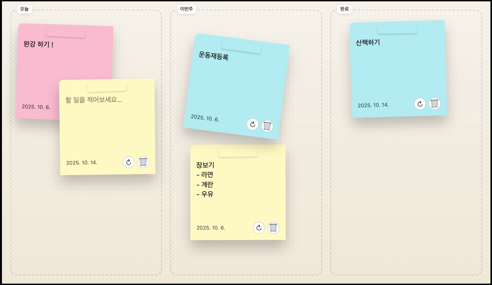

# Post-it 3D

> **Three.js WebGL 기반 3D 포스트잇 메모 애플리케이션**

브라우저에서 실제 코르크 보드 위에 포스트잇을 붙이는 듯한 경험을 제공하는 인터랙티브 웹앱입니다.

**[Live Demo](https://postit-3d.vercel.app)** | **[GitHub](https://github.com/04mmii/postit-3d)**

---

## Preview



---

## Features

- **3D 포스트잇** - 굴곡진 종이 효과가 적용된 리얼한 포스트잇
- **드래그 & 드롭** - Raycaster 기반 3D 공간에서 자유로운 배치
- **완료 체크박스** - 할 일 완료 표시 및 취소선 효과
- **색상 변경** - 노랑 / 핑크 / 민트 3가지 컬러
- **카메라 시차 효과** - 마우스 움직임에 따른 미세한 시점 변화
- **자동 저장** - LocalStorage 기반 데이터 영속성
- **IME 지원** - 한글 조합 중 입력 안정성 보장

---

## Tech Stack

| Category | Technology |
|----------|------------|
| **Framework** | React 18 + TypeScript |
| **3D Engine** | Three.js (WebGLRenderer) |
| **Build Tool** | Vite |
| **Styling** | Tailwind CSS |
| **Deployment** | Vercel |

---

## Architecture

```
┌─────────────────────────────────────────────────────┐
│                   WebGL Canvas                       │
│  ┌───────────────┐  ┌─────────────────────────────┐ │
│  │  Board3D      │  │  Note3DMesh (multiple)      │ │
│  │  - Cork       │  │  - Curled PlaneGeometry     │ │
│  │  - Frame      │  │  - CanvasTexture            │ │
│  └───────────────┘  │  - Raycaster Interaction    │ │
│                     └─────────────────────────────┘ │
├─────────────────────────────────────────────────────┤
│                  HTML Overlay                        │
│  ┌─────────────────────────────────────────────────┐│
│  │  NoteTextOverlay (editing mode)                 ││
│  │  - 3D→2D Position Sync                          ││
│  │  - Textarea Input                               ││
│  └─────────────────────────────────────────────────┘│
├─────────────────────────────────────────────────────┤
│                    Toolbar                           │
└─────────────────────────────────────────────────────┘
```

---

## Project Structure

```
src/
├── components/
│   ├── Board3D.tsx           # 코르크 보드 3D 메시
│   ├── Note3DMesh.tsx        # 포스트잇 3D 메시
│   ├── NoteTextOverlay.tsx   # HTML 텍스트 입력 오버레이
│   ├── NoteActionButtons.tsx # 액션 버튼 컴포넌트
│   ├── NotesLayer.tsx        # 노트 레이어 관리
│   └── Toolbar.tsx           # 툴바 UI
├── contexts/
│   ├── ThreeContext.tsx      # Three.js 씬/카메라/렌더러 관리
│   └── NotesContext.tsx      # 노트 상태 관리 + LocalStorage
├── hooks/
│   ├── useDrag.ts            # 드래그 커스텀 훅
│   ├── useLighting.ts        # 조명 설정 훅
│   └── useParallaxCamera.ts  # 카메라 시차 효과 훅
├── utils/
│   ├── createCurledGeometry.ts  # 굴곡진 Geometry 생성
│   ├── createNoteTexture.ts     # 포스트잇 CanvasTexture
│   ├── createCorkTexture.ts     # 코르크 절차적 텍스처
│   ├── projectToScreen.ts       # 3D↔2D 좌표 변환
│   ├── colors.ts                # 색상 정의
│   └── id.ts                    # UUID 생성
└── types/
    └── note.ts               # 타입 정의
```

---

## Technical Highlights

### 1. Custom Geometry - 굴곡진 포스트잇

```typescript
// 버텍스 조작으로 하단이 들린 종이 효과
for (let i = 0; i < positions.count; i++) {
  const y = positions.getY(i);
  const normalizedY = (y + height / 2) / height;
  const curl = Math.pow(1 - normalizedY, 2) * curlAmount;
  positions.setZ(i, curl);
}
```

### 2. Raycaster 기반 3D 인터랙션

```typescript
// 모든 메시에서 가장 위에 있는 카드만 선택
const allIntersects = raycaster.intersectObjects(allMeshes);
if (allIntersects[0].object === targetMesh) {
  // 선택된 카드 처리
}
```

### 3. 하이브리드 렌더링 (WebGL + HTML)

- **WebGL**: 3D 포스트잇, 코르크 보드, 조명
- **HTML Overlay**: 텍스트 입력 (3D→2D 좌표 동기화)

### 4. 절차적 텍스처 생성

Canvas API로 런타임에 코르크/포스트잇 텍스처 생성

### 5. 카메라 시차 효과

마우스 위치에 따른 부드러운 카메라 움직임으로 입체감 강화

---

## Getting Started

```bash
# 설치
npm install

# 개발 서버
npm run dev

# 프로덕션 빌드
npm run build

# 빌드 프리뷰
npm run preview
```

---

## Scripts

| Command | Description |
|---------|-------------|
| `npm run dev` | 개발 서버 실행 (Vite) |
| `npm run build` | 프로덕션 빌드 |
| `npm run preview` | 빌드 결과 로컬 프리뷰 |
| `npm run lint` | ESLint 검사 |

---

## Key Implementation Details

### IME (한글) 입력 처리
```typescript
// compositionstart/end로 조합 중 상태 관리
const handleCompositionStart = () => setIsComposing(true);
const handleCompositionEnd = (e) => {
  setIsComposing(false);
  updateNote(note.id, { text: e.target.value });
};
```

### 이벤트 충돌 방지
- 전역 드래그 잠금 (`__globalDragLock`)
- `stopPropagation()`으로 버튼/텍스트 영역 이벤트 분리

### 데이터 영속성
NotesContext에서 상태 변경 시 자동으로 LocalStorage에 동기화

---

## Browser Support

- Chrome (recommended)
- Firefox
- Safari
- Edge

---

## License

MIT

---

## Author

**04mmii**

- GitHub: [@04mmii](https://github.com/04mmii)
